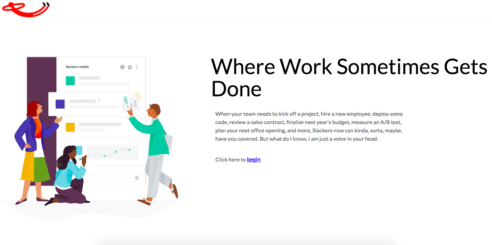
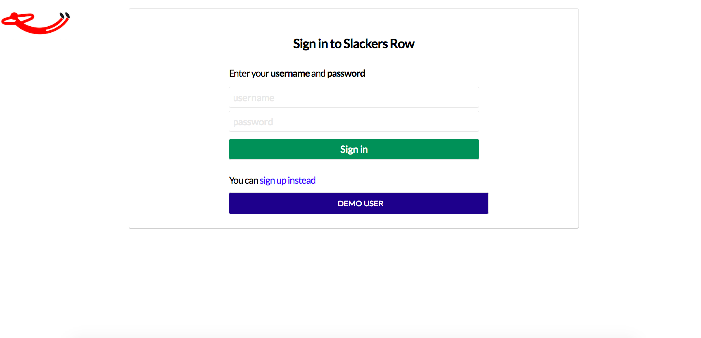

# Slackers-Row

[Click Here](https://slackers-row.herokuapp.com/) -- live App

Slackers-Row is a professional messaging app, cloned from Slack.



## Technologies

* Ruby on Rails backend
* React/Redux
* Websockets/Action Cable

## Authentication

Login Authentication utilizes BCrypt(blowfish under the hood) to hash passwords and URLSafe_base64 encoding for session token



## ActionCable
User can gain subscription to a channel, where messages created by other users will be broadcast
```
componentDidMount(){
  this.props.requestChannel(this.props.match.params.channelId);
  this.subscription = App.cable.subscriptions.create(
    {channel: 'ChatChannel', id: this.props.match.params.channelId},
    {received: (message) => {this.props.receiveMessage(message)}}
  );
}

```
Props will change to a new channelId when user clicks another channel. They will unsubscribe to the current channel, and subscribe to the new channel, causing a render call to populate the page with new messages.
```
componentWillReceiveProps(nextProps) {
  if (this.props.match.params.channelId !== nextProps.match.params.channelId) {
    this.props.requestChannel(nextProps.match.params.channelId);
    this.subscription.unsubscribe();
    this.subscription = App.cable.subscriptions.create(
      {channel: 'ChatChannel', id: nextProps.match.params.channelId},
      {received: (message) => {this.props.receiveMessage(message)}}
    );
  }
}
```

## Upcoming Features
* Direct Messaging
* Mention Another User
* Giphys
